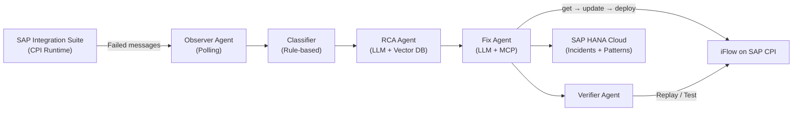

# SAP CPI Self-Healing Agent

**Autonomous AI-powered incident management for SAP Cloud Platform Integration**

---

## What It Does

The SAP CPI Self-Healing Agent continuously monitors your SAP Integration Suite for failed messages, analyzes root causes using an LLM, and autonomously applies fixes — without human intervention for well-understood error patterns.



---

## Key Capabilities

| Capability | Description |
|---|---|
| Autonomous detection | Polls SAP CPI every N seconds; detects failed messages automatically |
| Root cause analysis | LLM + vector search over SAP Notes for accurate diagnosis |
| Self-healing iFlows | Applies XML fixes and deploys in one pipeline (get → update → deploy) |
| Fix pattern learning | Stores successful fixes; reuses them for recurring errors |
| Progress tracking | Real-time `FIX_PROGRESS` tracker accessible via REST API |
| Smart escalation | Low-confidence incidents create tickets instead of guessing |
| Burst deduplication | Prevents reprocessing the same error within a configurable window |
| Autonomous loop safety | Deployment gated behind a configurable confidence threshold |
| Chatbot interface | Natural-language interface auto-routes "fix" queries to full pipeline |
| Bulk approval | Approve or reject multiple awaiting incidents in one call |
| Lock handling | Detects "iFlow is locked" and auto-unlocks before retrying |
| Rollback-ready snapshots | Captures iFlow XML before any change for rollback reference |
| AEM event streaming | Publishes fix lifecycle events to SAP Event Mesh |
| **Runtime Settings UI** | Operator-facing settings page to tune all fix behaviour, thresholds, and remediation policies live — no restart or code change required |

---

## Technology Stack

| Layer | Technology |
|---|---|
| Framework | FastAPI + Uvicorn |
| AI / LLM | LangChain, SAP AI Core (`ChatOpenAI` via `gen_ai_hub`) |
| MCP Protocol | `fastmcp >=2.14.5`, `langchain-mcp-adapters` |
| Database | SAP HANA Cloud (production), SQLite (local dev) via `hdbcli` |
| Object Storage | AWS S3 via `boto3` |
| Auth | OAuth 2.0 (SAP) with token caching |
| Async | `asyncio` / `httpx` |
| Python | `>=3.13` |
| Logging | `structlog` + rotating file handlers |

---

---

## Runtime Settings

All key operational constants can now be changed live through the **Settings** page in the Orbit UI (`/settings`) or directly via the REST API — no restart or code deployment required.

### How it works

A `RuntimeConfig` singleton (`core/runtime_config.py`) sits on top of the compiled constants. At startup it reads any persisted overrides from the `EM_RUNTIME_SETTINGS` HANA table. Every agent and the fix pipeline reads from this singleton at call time, so a change takes effect on the next incident, cycle, or tool call.

### Settings available

| Setting | Default | Impact | Takes Effect |
|---|---|---|---|
| Auto-Fix Confidence Threshold | `0.90` | High | Next fix-gate decision |
| Suggest-Fix Confidence Threshold | `0.70` | High | Next fix-gate decision |
| Enable Autonomous Fixing | `true` | High | **Immediate** |
| Auto-Deploy After Fix | `true` | High | Next fix reaching deploy step |
| Circuit Breaker Threshold | `5` | High | Next error on an existing iFlow |
| MCP Tool Retry Attempts | `3` | Medium | Next failed MCP tool call |
| Failed Message Fetch Limit | `100` | Medium | Next poll cycle |
| Max Unique Errors Per Cycle | `25` | Medium | Next poll cycle |
| Detail Fetch Concurrency | `8` | Low | Next poll cycle |
| Burst Dedup Window (seconds) | `60` | Medium | Next incoming event |
| Approval Timeout (hours) | `24` | Medium | Next approval sweep |
| Remediation Policies (per error type) | see defaults | High | Next fix-gate decision |

### API endpoints

```
GET    /settings          — return all settings with current values and schema metadata
PATCH  /settings          — update one or more settings   body: { "KEY": value, ... }
DELETE /settings/{key}    — reset a single setting to its compiled default
```

### Database

Overrides are persisted in the `EM_RUNTIME_SETTINGS` HANA table (auto-created on first startup). Each row stores the key, serialised value, data type, and who last updated it.

---

## Quick Links

- [Prerequisites](getting-started/prerequisites.md) — what you need before installing
- [Installation](getting-started/installation.md) — step-by-step setup
- [Configuration](getting-started/configuration.md) — all environment variables documented
- [Architecture Overview](architecture/overview.md) — how the components fit together
- [Fix Pipeline](pipelines/fix-pipeline.md) — end-to-end incident resolution flow
- [API Reference](api/endpoints.md) — REST endpoints
